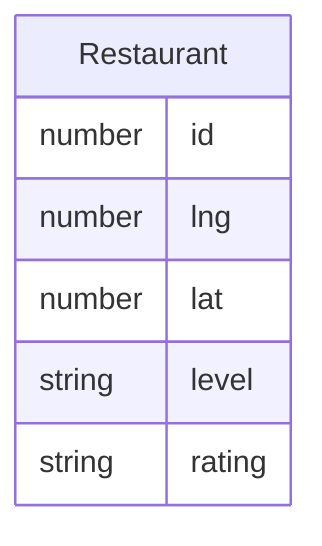

## 1. 架构设计

```mermaid
graph TB
    "前端页面(HTML/CSS/JS)" --> "高德地图 JS API"
    "前端页面(HTML/CSS/JS)" --> "restaurants.json"
    "高德地图 JS API" --> "地图渲染"
    "高德地图 JS API" --> "标记点"
    "高德地图 JS API" --> "信息弹窗"
```

纯前端架构，无后端服务。数据通过 JSON 文件持久化，页面直接读取本地 JSON 数据渲染。

## 2. 技术说明

- 前端：纯 HTML + CSS + JavaScript（单文件页面）
- 地图：高德地图 JS API 2.0
- 数据：本地 JSON 文件（restaurants.json）
- 构建工具：无（直接浏览器打开即可）

> 选择纯 HTML 方案而非 React，因为项目为单页面、功能简单、无复杂状态管理需求，纯 HTML 方案更轻量直接。

## 3. 路由定义

| 路由 | 用途 |
|------|------|
| / | 地图主页，展示快餐店标记点 |

## 4. API 定义

无后端 API。前端直接读取 `restaurants.json` 文件。

## 5. 数据模型

### 5.1 数据模型定义



### 5.2 数据定义

**restaurants.json 结构：**

| 字段 | 类型 | 必填 | 说明 |
|------|------|------|------|
| id | number | 是 | 唯一标识 |
| lng | number | 是 | 经度 |
| lat | number | 是 | 纬度 |
| level | string | 是 | 等级：夯/顶级/人上人/npc/拉完了 |
| rating | string | 是 | 评价文字 |

**等级颜色映射：**

| 等级 | 颜色 | 色值 |
|------|------|------|
| 夯 | 绿色 | #22C55E |
| 顶级 | 蓝色 | #3B82F6 |
| 人上人 | 橙色 | #F97316 |
| npc | 黄色 | #EAB308 |
| 拉完了 | 红色 | #EF4444 |
